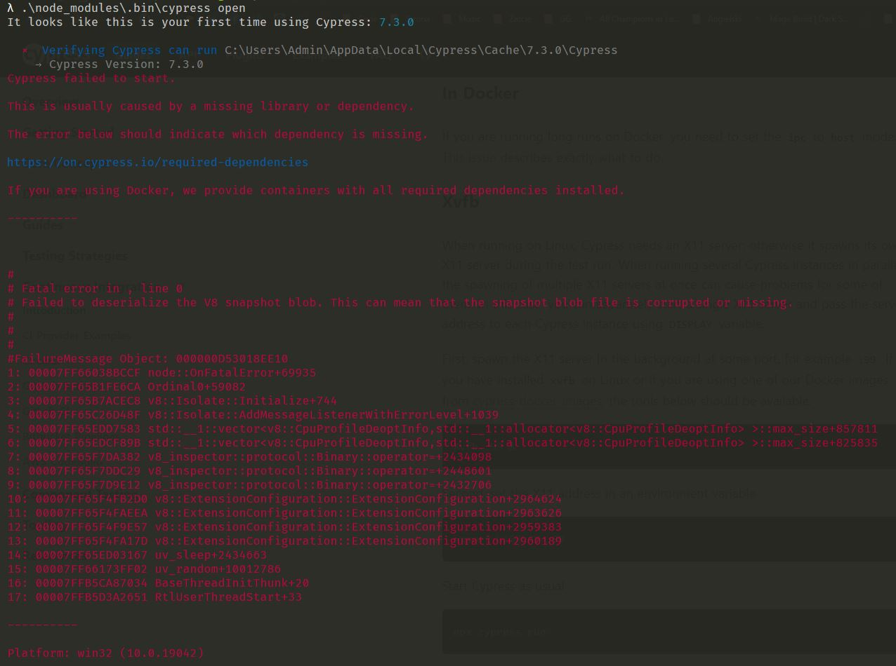

## Cypress error story

Last week after my job interview I've decided to learn about some e2e testing environment and as you probably already noticed, I've chosen Cypress.

So I've opened \[Cypress docs](https://docs.cypress.io/guides/getting-started/installing-cypress#npm-install) and I've followed all necessary steps to install their framework. After the installation process was finished, I just hopped to my project and I run:

```shell
npx cypress open
```

unfortunately for me, my commend line threw one big error right into my face, and I was stuck for a long time with it, but after some time I've found one workaround that helped me to successfully install and run Cypress on my Machine.

### ERROR BODY

The error that I've met at the start of my e2e testing road looked like this:



Trust me I've looked in many stackoverflow and other community blog posts to find a solution and finally, I've found a workaround! 

## SOLUTION

You have to do few very easy steps to run successfully Cypress on your Windows PC if you have met this problem.

First of all, you have to follow the whole installation process from \[DOCS](https://docs.cypress.io/guides/getting-started/installing-cypress#npm-install).

After installation is finished, go to the root of your project where you have installed cypress via command line and use the following command:

```shell
.\node_modules\.bin\cypress.cmd install --force
```

The "--force" flag is necessary, otherwise, the installation may not proceed.

This command should trigger the final build of the Cypress framework, and from now Windows shouldn't bother you with this error again unless the next Cy version will be released, then maybe you will be forced to repeat the whole process again.

##### The end

If this post has not helped you somehow to solve issues with your installation, please leave me a note and I'll try to help you as much as I can.